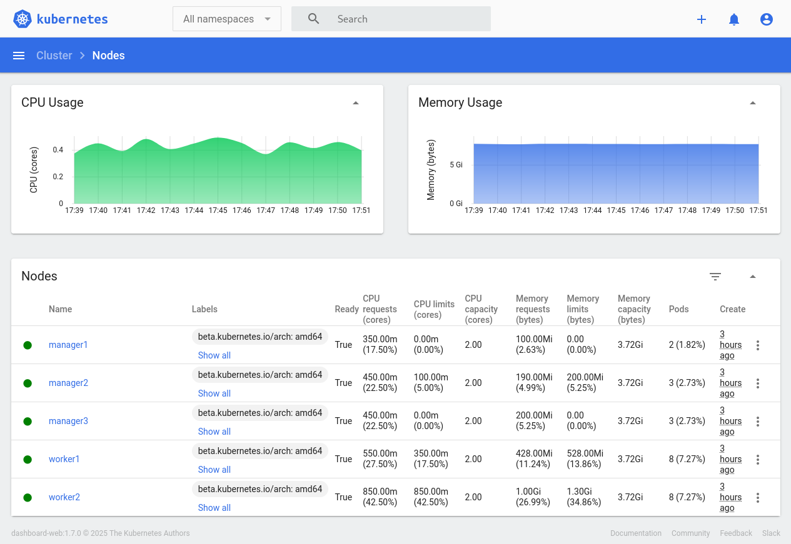

# 🧩 k8s-in-a-box

Kubernetes in a Box – uma instalação manual de um cluster Kubernetes com alta disponibilidade, provisionado via Ansible e orquestrado com Vagrant usando LibVirt.



> 💡 Construído usando o Kubernetes v1.35.0 ([v1.35 Timbernetes - The World Tree Release](https://kubernetes.io/blog/2025/12/17/kubernetes-v1-35-release/))

Este projeto nasceu como uma evolução natural de outro projeto de estudos ([vndmtrx/vagrant-k8s-cluster](https://github.com/vndmtrx/vagrant-k8s-cluster)), onde o cluster era criado utilizando o `kubeadm`. Durante aquele desenvolvimento, percebi que boa parte das etapas executadas pelo `kubeadm` (como a geração de certificados, configuração do etcd e bootstrap dos componentes do control plane) aconteciam de forma automática, sem que eu realmente compreendesse o que estava acontecendo nos bastidores.

Com isso, o **k8s-in-a-box** surgiu como uma forma de reconstruir esse processo manualmente, etapa por etapa, para entender profundamente como o Kubernetes realmente se forma: dos certificados ao control plane e worker nodes.

Este projeto segue a filosofia *"Kubernetes The Hard Way"* ([kelseyhightower/kubernetes-the-hard-way](https://github.com/kelseyhightower/kubernetes-the-hard-way)), demonstrando cada fase de instalação dos componentes essenciais (`PKI`, `etcd`, `Control Plane` e `Worker Nodes`) sem recorrer a ferramentas de conveniência como `kubeadm` ou `k3s`.

O objetivo é oferecer um laboratório de estudos que permita compreender os fundamentos do Kubernetes em sua forma mais pura, mantendo ainda a automação e reprodutibilidade via Ansible.


## Estado Atual do Projeto

Este projeto está em desenvolvimento ativo, seguindo uma abordagem progressiva de construção do cluster Kubernetes.  

Além da implementação prática do cluster, também está sendo criada uma documentação detalhada sobre cada etapa do processo, explicando as decisões tomadas em cada fase: da escolha de tecnologias e configurações de rede/infraestrutura à instalação dos componentes de controle e nós de trabalho.  

A implementação segue uma sequência lógica que respeita as dependências entre os componentes, garantindo reprodutibilidade e clareza em todo o processo.

### Documentação

Todo o material de referência e guias de instalação encontra‑se no diretório `docs/` do repositório. O índice completo, com links para cada seção, está disponível em [`docs/README.md`](./docs/README.md).

## Visão Geral

O repositório automatiza a criação de várias máquinas virtuais em uma rede privada para as VMs, onde o cluster e as ferramentas anexas são instaladas, não criando nada na máquina host.

Com o Ansible como provedor de automação, cada componente do cluster é instalado e configurado explicitamente: geração de certificados, criação do cluster `etcd`, deployment dos binários `kube‑apiserver`, `controller‑manager`, `scheduler`, `containerd`, `kubelet` e `kube‑proxy`, além da instalação dos vários plugins de suporte do cluster.

### Componentes Concluídos
- Infraestrutura com Vagrant/LibVirt
- Framework de Automação Ansible
- Sistema Base das VMs (AlmaLinux 10)
- PKI (Certificados para todos componentes)
- Load Balancer (HAProxy)
- Cluster etcd
- Manager nodes (Control Plane)
- Worker Nodes
- Arquivos de Configuração
- Addons de Cluster (CNI, CoreDNS, Métricas, Ingress Controller, Dashboard, MetalLB)
- Ferramentas de gerenciamento (etcdctl, kubectl, helm)
- Exemplos de deploys no cluster

> 💡 Para um acompanhamento detalhado do desenvolvimento, incluindo todos os componentes e suas dependências, consulte o [Mapa de Progresso](docs/progresso.md).

## Decisões de Design

Algumas escolhas foram tomadas para simplificar o laboratório e maximizar o aprendizado:
1. **LibVirt + Vagrant**: optou‑se pelo provider LibVirt devido ao desempenho superior e melhor integração com o Vagrant. Outros providers podem ser utilizados, mas não estão cobertos neste projeto.
1. **Rede Privada 172.24.0.0/24**: todas as VMs estão em uma rede privada, evitando conflitos com redes domésticas. Os pods e serviços usam redes separadas para manter isolamento.
1. **Alta Disponibilidade**: HAProxy e Keepalived fornecem um VIP (`172.24.0.10`) e fazem balanceamento do etcd e do API Server, permitindo um failover transparente dos endpoints.
1. **Sistema Base AlmaLinux 10**: escolhido pela facilidade em relação à configuração de rede e pela disponibilidade de imagens atualizadas no Vagrant Cloud Images; outras distribuições podem exigir ajustes.
1. **Certificados Gerenciados**: a geração de uma cadeia PKI completa (Root CA, CAs intermediárias e certificados de cliente e servidor) garante segurança entre todos os componentes, e também foi feita dessa forma para experimentações com rotação de certificados.
1. **Runtime de Conteiners**: Foi utilizado o CRI-O pela simplicidade de instalação na distribuição atual. O containerd também foi disponibilizado caso haja preferência ou para estudo.
1. **Plugin de Rede**: Foi utilizado o Canal (Calico + Flannel) como padrão para uso completo dos recursos de rede, como Network Policies. O CNI Flannel simples também foi disponibilizado.

## Arquitetura e Configurações de Instalação

Aqui está a base do laboratório: uma topologia mínima funcional e uma topologia de referência. A mínima existe para quem tem menos memória disponível; a de referência é a em uso atualmente e serve de guia para as configurações abaixo.

A personalização do cluster é feita em dois arquivos principais:
- `inventario/hosts.yml` que define as VMs que compõem o cluster. Cada host contém endereço IP, FQDN, memória e CPU. Máquinas adicionais podem ser habilitadas descomentando blocos adicionais para managers ou workers. Exemplos de definições padrão:
  - **Configuração mínima para rodar:**
    - 1x `LoadBalancer`: *vCPUs: 1; RAM: 384MB*
    - 1x `Servidor NFS`: *vCPUs: 1; RAM: 384MB*
    - 1x `Manager`:      *vCPUs: 1; RAM: 2048MB*
    - 1x `Worker`:       *vCPUs: 1; RAM: 2048MB*
    - 1x `Bastion Host`: *vCPUs: 1; RAM: 384MB*
    
    *Totalizando 5,2GB de RAM e 5 vCPUs;*
  
  - **Configuração de Referência do projeto:**
    - 2x `LoadBalancer`: *vCPUs: 2; RAM: 512MB*
    - 1x `Servidor NFS`: *vCPUs: 2; RAM: 384MB*
    - 3x `Manager`:      *vCPUs: 3; RAM: 3072MB*
    - 2x `Worker`:       *vCPUs: 3; RAM: 3072MB*
    - 1x `Bastion Host`: *vCPUs: 1; RAM: 384MB*

    *Totalizando 16,2GB de RAM e 11 vCPUs;*

* `inventario/group_vars/all.yml` define as variáveis globais do projeto e centraliza as configurações que controlam o comportamento das *roles* do Ansible. É nele que se personaliza a instalação e o funcionamento do cluster.
  Algumas das principais opções que podem ser ajustadas:

  * **Runtime de Conteiner** permite a escolha entre `crio` ou `containerd` para a parte de conteiners.
  * **Plugin de CNI:** permite escolher entre `flannel` ou `canal` (Flannel + Calico) para a rede dos pods.
  * **Versões dos componentes:** define quais versões do Kubernetes, etcd, Helm e CNI Plugins serão utilizadas.
  * **Redes do cluster:** configura os blocos de endereçamento das redes de *hosts*, *pods* e *services*.
  * **Faixas de IPs do MetalLB:** controla os intervalos disponíveis para LoadBalancers e IPs fixos.
  * **Parâmetros de HAProxy e Keepalived:** ajusta timeouts, portas e o IP virtual (VIP) usado para alta disponibilidade.
  * **Certificados e artefatos:** define estrutura de diretórios e se os certificados serão regenerados automaticamente.

> 💡 Juntos, `hosts.yml` e `all.yml` formam o núcleo de personalização do projeto: o primeiro define onde o cluster será executado, e o segundo define como ele será configurado.
> O cluster pode ser expandido ou reduzido conforme a capacidade de memória e processamento disponível, bastando ajustar os parâmetros definidos nos arquivos de inventário.

### Topologia de rede

As VMs ficam em uma **rede privada** (`172.24.0.0/24`) e os **pods/serviços** usam faixas separadas para evitar conflitos:

* **Hosts (VMs):** `172.24.0.0/24`
* **Pods:** `172.25.0.0/17`
* **Serviços:** `172.25.128.0/17`

O ambiente expõe um **VIP** para alta disponibilidade do plano de controle via Keepalived e HAProxy (`172.24.0.10`), mapeado por FQDNs como `api.k8sbox.local` e `etcd.k8sbox.local`.
Se desejar expor serviços via LoadBalancer, há faixas pré-definidas para o MetalLB (pool “manuais” e pool “L2”), que podem ser ajustadas conforme sua rede local.

Inclusive, é possível verificar o status do HAProxy em [http://172.24.0.21:9000/stats](http://172.24.0.21:9000/stats) (usuário/senha: `admin` / `senha_muito_segura!`).

> 💡 A senha da página de status HAProxy é exclusiva para o laboratório. Caso queira mudar, existe uma variável em [inventario/group_vars/all.yml](inventario/group_vars/all.yml) em que você pode alterar essa (e outras) informações.

### Componentes e alta disponibilidade

* **Balanceamento:** HAProxy faz o **failover** e o balanceamento do **kube-apiserver** e do **etcd**.
* **PKI:** toda a comunicação entre componentes é protegida por certificados emitidos pela **cadeia PKI** do projeto (Root CA + CAs intermediários para cada componente core).
* **Runtime:** `crio` como padrão pela simplicidade e estabilidade; `containerd` disponível.
* **CNI:** `canal` (Calico + Flannel) como padrão (rede e políticas); `flannel` disponível como opção mais leve.
* **Bastion (kubox):** host com `kubectl`, `etcdctl`, `helm` e utilitários para operar e inspecionar o cluster sem “poluir” os nós.

### Ordem de provisionamento (resumo)

O `Makefile` e os playbooks do Ansible conduzem a instalação em etapas, respeitando as dependências:

1. **Artefatos e PKI** (binários, CAs e certificados)
2. **Sistema Base** (pré-requisitos de SO, tunáveis de rede)
3. **Balanceador** (HAProxy/Keepalived)
4. **etcd** (cluster e mTLS)
5. **Control Plane** (API Server, Controller Manager, Scheduler)
6. **Workers** (containerd, kubelet, kube-proxy)
7. **Addons** (CNI, CoreDNS, métricas, dashboard, ingress, MetalLB, etc.)

Você pode executar tudo de ponta a ponta com `make k8s-in-a-box` ou chamar **targets**/tags individuais para depurar etapas específicas.

### Customizações rápidas

As principais opções ficam em `inventario/group_vars/all.yml`:

* **Rede dos hosts/pods/serviços:** `rede_cidr_hosts`, `rede_cidr_pods`, `rede_cidr_services`
* **CNI:** `plugin_cni: "canal"` (opções: `canal` ou `flannel`)
* **VIP/HAProxy/Keepalived:** `keepalived_vip_ip`, `vip_api_fqdn`, `vip_etcd_fqdn`, timeouts e credenciais do HAProxy
* **MetalLB:** `metallb_ips_manuais` e `metallb_ips_loadbalacing`
* **Versões:** `versao_kubernetes`, `versao_etcd`, `versao_cni`, `versao_helm`

> 💡 Dica: ajuste primeiro CPU/RAM no `inventario/hosts.yml`. Em seguida, valide **rede** e **VIP**. Por fim, escolha o **CNI** conforme o objetivo: `canal` (recursos avançados) ou `flannel` (menor consumo de memória).

## Início Rápido

1. Clone o repositório:
```bash
git clone https://github.com/vndmtrx/k8s-in-a-box.git
cd k8s-in-a-box
```

2. Faça o provisionamento da estrutura completa
```bash
make k8s-in-a-box
```

## Acessando as VMs

Use o comando abaixo para acessar individualmente cada máquina virtual do projeto:
```bash
vagrant ssh <nome da VM>
```

## Rede

Todas as máquinas estão em uma rede privada (`172.24.0.0/24`), sendo as importantes para o acesso ao cluster as seguintes:
- IP Flutuante do balanceador: `172.24.0.10`
- IP do Bastion Host: `172.24.0.254`

## Operação do Cluster

Para a operação do cluster (e melhor simulação de um ambiente real), as ferramentas de interação com o `etcd` e o cluster foram instaladas em um outro host, chamado `kubox`. Caso queira verificar o cluster, seguem alguns comandos úteis (para acessar o bastion host, use `vagrant ssh kubox`):
- `etcdctl`
  - Lista de Membros do cluster: `etcdctl member list -w json | yq -P | tspin`
  - Saúde dos endpoints: `etcdctl endpoint health -w json | yq -P | tspin`
  - Status do cluster: `etcdctl endpoint status -w json | yq -P | tspin`
  - Status do Raft: `etcdctl endpoint hashkv -w json | yq -P | tspin`
- `kubectl`
  - Listar todos os nós: `kubectl get nodes -o wide`
  - Listar todos os pods: `kubectl get pods -A -o wide`
  - Últimos eventos do cluster: `kubectl get events -A --sort-by=.metadata.creationTimestamp`

## Acesso ao Dashboard e Inspetor de Rede

No cluster o Kubernetes Dashboard foi ativado, permitindo a verificação dos diversos componentes do cluster.

Para acessar o Kubernetes Dashboard, é só acessar a URL [https://172.24.0.101](https://172.24.0.101/), e quando for solicitado o token, é só usar o seguinte comando no bastion host:

```bash
kubectl -n dashboard create token dashboard-admin
```

## Destruindo o ambiente

Quando terminar os testes, o cluster pode ser destruído com o comando:

```bash
make destroy
```

E caso queira destruir o ambiente e também excluir os temporários baixados:

```bash
make clean
```

## Notas Importantes

- A chave SSH gerada por esse Vagrant (`id_ed25519.pub`) é apenas para exemplo/desenvolvimento
- **NÃO USE** esta chave em ambiente de produção
- Para produção, sempre gere e use suas próprias chaves SSH
- O `Makefile` do projeto utiliza uma configuração específica do Ansible localizada em `./ansible/.ansible.cfg`

## Conformidade e Validação

Como parte do estudo, o cluster foi também submetido ao teste de conformidade oficial da CNCF, utilizando a ferramenta `sonobuoy`.  
Esse teste é o mesmo utilizado para validar distribuições Kubernetes certificadas, verificando a compatibilidade e o comportamento esperado dos componentes centrais do sistema.

A execução foi **bem-sucedida**, com todos os testes aplicáveis aprovados, confirmando que o ambiente atende às especificações oficiais do Kubernetes.  
O processo avaliou desde o plano de controle até os nós de trabalho, garantindo a integridade e o funcionamento coerente de todo o cluster.

Esse resultado representa o esforço de automação construído com **Ansible**, **Vagrant** e **LibVirt**, que permite não apenas reproduzir o ambiente de forma consistente, mas também estudar e compreender cada etapa da formação de um cluster Kubernetes completo e funcional.

## Nota Pessoal

Este repositório é resultado de um estudo contínuo sobre como montar um cluster Kubernetes manualmente. Ele não é recomendado para uso em produção, apesar de ser bastante resiliente.

Este projeto não é apenas uma implementação, mas um caminho de estudo estruturado para compreender cada aspecto do funcionamento do Kubernetes.

Sinta‑se à vontade para contribuir com sugestões, issues e pull requests.

## Licença

Este projeto está licenciado sob a [Licença MIT](LICENSE) - veja o arquivo LICENSE para detalhes.

---

⚠️ **Projeto em desenvolvimento**
