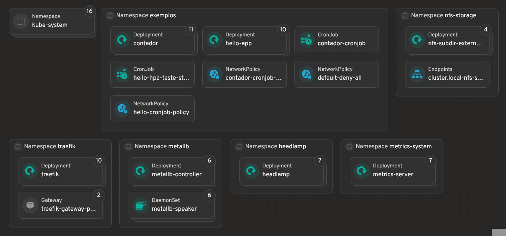

# 🧩 k8s-in-a-box

Kubernetes in a Box, uma instalação manual de um cluster Kubernetes com alta disponibilidade, provisionado via Ansible e orquestrado com Vagrant usando LibVirt.



> 💡 Construído usando o Kubernetes v1.36.1 ([Kubernetes v1.36 - Haru Release Notes](https://kubernetes.io/blog/2026/04/22/kubernetes-v1-36-release/))

Este projeto nasceu como uma evolução natural de outro projeto de estudos ([vndmtrx/vagrant-k8s-cluster](https://github.com/vndmtrx/vagrant-k8s-cluster)), onde o cluster era criado utilizando o `kubeadm`. Durante aquele desenvolvimento, percebi que boa parte das etapas executadas pelo `kubeadm` (como a geração de certificados, configuração do etcd e bootstrap dos componentes do control plane) aconteciam de forma automática, sem que eu realmente compreendesse o que estava acontecendo nos bastidores.

Com isso, o **k8s-in-a-box** surgiu como uma forma de reconstruir esse processo manualmente, etapa por etapa, para entender profundamente como o Kubernetes realmente se forma: dos certificados ao control plane e worker nodes.

Este projeto segue a filosofia *"Kubernetes The Hard Way"* ([kelseyhightower/kubernetes-the-hard-way](https://github.com/kelseyhightower/kubernetes-the-hard-way)), demonstrando cada fase de instalação dos componentes essenciais (`PKI`, `etcd`, `Control Plane` e `Worker Nodes`) sem recorrer a ferramentas de conveniência como `kubeadm` ou `k3s`.

O objetivo é oferecer um laboratório de estudos que permita compreender os fundamentos do Kubernetes em sua forma mais pura, mantendo ainda a automação e reprodutibilidade via Ansible.

> [!IMPORTANT]
> **Aviso Importante / Disclaimer:**  
> Este projeto foi concebido estritamente para **fins de estudo, experimentação e aprendizado detalhado** sobre a construção e o funcionamento interno de cada componente de um cluster Kubernetes. Ele **não** tem o intuito de substituir ferramentas consagradas de montagem rápida e gerenciamento de clusters, como `kubeadm`, `k3s`, `k0s`, `minikube` ou `kind`. O objetivo principal aqui é abrir a "caixa preta" do Kubernetes, permitindo que o estudante interaja manualmente com etapas que costumam ser abstraídas por essas ferramentas.


## Estado Atual do Projeto

Este projeto está em desenvolvimento ativo, seguindo uma abordagem progressiva de construção do cluster Kubernetes.  

Além da implementação prática do cluster, também está sendo criada uma documentação detalhada sobre cada etapa do processo, explicando as decisões tomadas em cada fase: da escolha de tecnologias e configurações de rede/infraestrutura à instalação dos componentes de controle e nós de trabalho.  

A implementação segue uma sequência lógica que respeita as dependências entre os componentes, garantindo reprodutibilidade e clareza em todo o processo.

### Documentação

Todo o material de referência e guias de instalação encontra‑se no diretório `docs/` do repositório. O índice completo, com links para cada seção, está disponível em [`docs/README.md`](./docs/README.md).

## Visão Geral

O repositório automatiza a criação de várias máquinas virtuais em uma rede privada para as VMs, onde o cluster e as ferramentas anexas são instaladas, não criando nada na máquina host.

Com o Ansible como provedor de automação, cada componente do cluster é instalado e configurado explicitamente: geração de certificados, criação do cluster `etcd`, deployment do plano de controle como **Static Pods** gerenciados pelo `kubelet`, instalação do runtime de contêiner e do `kubelet`, além da instalação dos vários plugins de suporte do cluster. O `kube‑proxy` é provisionado posteriormente como um **DaemonSet** dentro do próprio cluster.

### Componentes Concluídos
- Infraestrutura com Vagrant/LibVirt
- Framework de Automação Ansible
- Sistema Base das VMs (AlmaLinux 10)
- PKI (Certificados para todos componentes)
- Load Balancer (HAProxy)
- Cluster etcd
- Manager nodes (Control Plane)
- Worker Nodes
- Arquivos de Configuração
- Hardening SELinux (política customizada de Type Enforcement)
- Addons de Cluster (CNI, CoreDNS, Métricas, Gateway API, Dashboard, MetalLB)
- Ferramentas de gerenciamento (etcdctl, kubectl, helm)
- Exemplos de deploys no cluster

> 💡 Para um acompanhamento detalhado do desenvolvimento, incluindo todos os componentes e suas dependências, consulte o [Mapa de Progresso](docs/progresso.md).

## Decisões de Design

Algumas escolhas foram tomadas para simplificar o laboratório e maximizar o aprendizado:
1. **LibVirt + Vagrant**: optou‑se pelo provider LibVirt devido ao desempenho superior e melhor integração com o Vagrant. Outros providers podem ser utilizados, mas não estão cobertos neste projeto.
1. **Rede Privada 172.24.0.0/24**: todas as VMs estão em uma rede privada, evitando conflitos com redes domésticas. Os pods e serviços usam redes separadas para manter isolamento.
1. **Alta Disponibilidade**: HAProxy e Keepalived fornecem um VIP (`172.24.0.10`) e fazem balanceamento do etcd e do API Server, permitindo um failover transparente dos endpoints.
1. **Sistema Base AlmaLinux 10**: escolhido pela facilidade em relação à configuração de rede e pela disponibilidade de imagens atualizadas no Vagrant Cloud Images; outras distribuições podem exigir ajustes.
1. **Certificados Gerenciados**: a geração de uma cadeia PKI completa (Root CA, CAs intermediárias e certificados de cliente e servidor) garante segurança entre todos os componentes, e também foi feita dessa forma para experimentações com rotação de certificados.
1. **Runtime de Conteiners**: Foi utilizado o CRI-O pela simplicidade de instalação na distribuição atual. O containerd também foi disponibilizado caso haja preferência ou para estudo.
1. **Plugin de Rede**: Foi utilizado o Canal (Calico + Flannel) como padrão para uso completo dos recursos de rede, como Network Policies. O CNI Flannel simples também foi disponibilizado.
1. **Control Plane via Static Pods**: em vez de instalar os componentes do plano de controle (`etcd`, `kube-apiserver`, `kube-controller-manager` e `kube-scheduler`) como serviços do sistema operacional gerenciados pelo `systemd` (modo tradicional), optou-se pela implantação via **Static Pods**. Isso simplifica o processo ao eliminar a necessidade de criar e gerenciar múltiplos Unit Files do systemd para cada componente, alinhando o projeto com as práticas de instalações modernas do Kubernetes (como o `kubeadm`). 
   * *Nota de Evolução:* Inicialmente, o projeto nasceu de forma puramente *"hard way"*, instalando cada um dos componentes manualmente a nível de sistema operacional (com downloads diretos e unit files manuais). A consolidação para Static Pods, embora ainda preserve o aspecto *"hard way"* (já que toda a cadeia PKI, certificados, arquivos de configuração e parâmetros ainda são gerados manualmente etapa por etapa pelo Ansible), adota uma arquitetura mais moderna, organizada e resiliente (o próprio Kubelet gerencia o ciclo de vida e a saúde dos componentes do control plane locais).
1. **kube-proxy como DaemonSet**: em vez de rodar como serviço systemd estático, o `kube-proxy` é provisionado como um DaemonSet dentro do cluster. Isso simplifica o bootstrap inicial e dispensa a necessidade de certificados de cliente dedicados (autentica via `ServiceAccount`).
1. **SELinux ativo com política customizada**: em vez de desabilitar o SELinux como a maioria dos tutoriais orienta, o projeto mantém o SELinux ativo e compila uma política de Type Enforcement customizada (`k8s-custom-selinux`) que resolve os alertas de segurança mantendo o confinamento dos containers. Para detalhes, consulte a [documentação de SELinux](docs/selinux.md).
1. **Cache Local de Imagens com Skopeo**: para evitar downloads repetitivos a cada recriação do cluster, o projeto armazena em cache no host os tarballs das imagens necessárias (via `skopeo copy`). Nas VMs, elas são distribuídas e carregadas diretamente no CRI-O (`containers-storage`) ou Containerd (`ctr`).
1. **Extração do `etcdctl` via OverlayFS**: em vez de baixar um tarball completo do Etcd da internet para obter o binário cliente no host de operação (`kubox`), o Ansible o extrai diretamente do OverlayFS (merged layer) do container etcd em execução no control plane.

## Arquitetura e Configurações de Instalação

Aqui está a base do laboratório: uma topologia mínima funcional e uma topologia de referência. A mínima existe para quem tem menos memória disponível; a de referência é a em uso atualmente e serve de guia para as configurações abaixo.

A personalização do cluster é feita em dois arquivos principais:

- **Configurações de cluster pré-definidas** (`configs/hosts-*.yml`): o projeto oferece três configurações prontas para diferentes cenários:
  - `configs/hosts-nano.yml` - configuração mínima para ambientes com recursos limitados
  - `configs/hosts-mini.yml` - configuração padrão balanceada (padrão do projeto)
  - `configs/hosts-completo.yml` - configuração completa para estudos avançados e testes de alta disponibilidade
  
  A configuração ativa é controlada via symlink em `inventario/hosts.yml`, controlado pelo `Makefile`. Cada arquivo define as VMs que compõem o cluster, contendo endereço IP, FQDN, memória e CPU para cada host.


* `inventario/group_vars/all.yml` define as variáveis globais do projeto e centraliza as configurações que controlam o comportamento das *roles* do Ansible. É nele que se personaliza a instalação e o funcionamento do cluster.
  Algumas das principais opções que podem ser ajustadas:

  * **Runtime de Conteiner** permite a escolha entre `crio` ou `containerd` para a parte de conteiners.
  * **Plugin de CNI:** permite escolher entre `flannel` ou `canal` (Flannel + Calico) para a rede dos pods.
  * **Versões dos componentes:** define quais versões do Kubernetes, etcd, Helm e CNI Plugins serão utilizadas.
  * **Redes do cluster:** configura os blocos de endereçamento das redes de *hosts*, *pods* e *services*.
  * **Faixas de IPs do MetalLB:** controla os intervalos disponíveis para LoadBalancers e IPs fixos.
  * **Parâmetros de HAProxy e Keepalived:** ajusta timeouts, portas e o IP virtual (VIP) usado para alta disponibilidade.
  * **Certificados e artefatos:** define estrutura de diretórios e se os certificados serão regenerados automaticamente.

> 💡 Juntos, `hosts.yml` e `all.yml` formam o núcleo de personalização do projeto: o primeiro define onde o cluster será executado, e o segundo define como ele será configurado.
> O cluster pode ser expandido ou reduzido conforme a capacidade de memória e processamento disponível, bastando ajustar os parâmetros definidos nos arquivos de inventário.

### Topologia de rede

As VMs ficam em uma **rede privada** (`172.24.0.0/24`) e os **pods/serviços** usam faixas separadas para evitar conflitos:

* **Hosts (VMs):** `172.24.0.0/24`
* **Pods:** `172.25.0.0/17`
* **Serviços:** `172.25.128.0/17`

O ambiente expõe um **VIP** para alta disponibilidade do plano de controle via Keepalived e HAProxy (`172.24.0.10`), mapeado por FQDNs como `api.k8sbox.local` e `etcd.k8sbox.local`.
Se desejar expor serviços via LoadBalancer, há faixas pré-definidas para o MetalLB (pool “manuais” e pool “L2”), que podem ser ajustadas conforme sua rede local.

Inclusive, é possível verificar o status do HAProxy em [http://172.24.0.21:9000/stats](http://172.24.0.21:9000/stats) (usuário/senha: `admin` / `senha_muito_segura!`).

> 💡 A senha da página de status HAProxy é exclusiva para o laboratório. Caso queira mudar, existe uma variável em [inventario/group_vars/all.yml](inventario/group_vars/all.yml) em que você pode alterar essa (e outras) informações.

### Componentes e alta disponibilidade

* **Balanceamento:** HAProxy faz o **failover** e o balanceamento do **kube-apiserver** e do **etcd**.
* **PKI:** toda a comunicação entre componentes é protegida por certificados emitidos pela **cadeia PKI** do projeto (Root CA + CAs intermediários para cada componente core).
* **Runtime:** `crio` como padrão pela simplicidade e estabilidade; `containerd` disponível.
* **CNI:** `canal` (Calico + Flannel) como padrão (rede e políticas); `flannel` disponível como opção mais leve.
* **kube-proxy:** provisionado como DaemonSet dentro do cluster, autenticando-se via `ServiceAccount`; sem certificados de cliente próprios.
* **Bastion (kubox):** host com `kubectl`, `etcdctl`, `helm` e utilitários para operar e inspecionar o cluster sem “poluir” os nós.

### Ordem de provisionamento (resumo)

O `Makefile` e os playbooks do Ansible conduzem a instalação em etapas, respeitando as dependências:

1. **Artefatos e PKI** (binários, CAs e certificados)
2. **Sistema Base** (pré-requisitos de SO, tunáveis de rede)
3. **Balanceador** (HAProxy/Keepalived)
4. **kubelet + SELinux** (runtime de container, plugins CNI, política customizada de SELinux e configuração do kubelet)
5. **etcd** (cluster e mTLS)
6. **Control Plane** (API Server, Controller Manager, Scheduler)
7. **Addons** (CNI, CoreDNS, métricas, dashboard, Gateway API, MetalLB, etc.)
8. **kube-proxy** (DaemonSet aplicado via `kubox` após o cluster estar funcional)

Você pode executar tudo de ponta a ponta com `make k8s-in-a-box` ou chamar **targets**/tags individuais para depurar etapas específicas.

### Customizações rápidas

As principais opções ficam em `inventario/group_vars/all.yml`:

* **Rede dos hosts/pods/serviços:** `rede_cidr_hosts`, `rede_cidr_pods`, `rede_cidr_services`
* **CNI:** `plugin_cni: "canal"` (opções: `canal` ou `flannel`)
* **VIP/HAProxy/Keepalived:** `keepalived_vip_ip`, `vip_api_fqdn`, `vip_etcd_fqdn`, timeouts e credenciais do HAProxy
* **MetalLB:** `metallb_ips_manuais` e `metallb_ips_loadbalacing`
* **Versões:** `versao_kubernetes`, `versao_etcd`, `versao_cni`, `versao_helm`

> 💡 Dica: ajuste primeiro CPU/RAM no `inventario/hosts.yml`. Em seguida, valide **rede** e **VIP**. Por fim, escolha o **CNI** conforme o objetivo: `canal` (recursos avançados) ou `flannel` (menor consumo de memória).

## Início Rápido

1. Clone o repositório:
```bash
git clone https://github.com/vndmtrx/k8s-in-a-box.git
cd k8s-in-a-box
```

2. (Opcional) Defina a configuração do cluster no arquivo `config.mk` na raiz do projeto (crie o arquivo se não existir):
```makefile
CLUSTER = mini # Opções: nano, mini, completo
```
E então ative-a rodando:
```bash
make init
```

3. Verifique a configuração ativa:
```bash
make status
```

4. Faça o provisionamento da estrutura completa:
```bash
make k8s-in-a-box
```

> 💡 Se você não executar `make init`, o projeto usará automaticamente a configuração `mini` como padrão.

## Gerenciamento de Configurações

O projeto utiliza um sistema de configurações baseado em symlinks para facilitar a alternância entre diferentes topologias de cluster.

### Comandos disponíveis

- **Verificar dependências locais:** `make check-deps` (valida se o host possui Ansible, Vagrant, Libvirt, KVM e plugins configurados)
- **Ativar uma configuração:** `make init` (carrega e ativa o tipo configurado em `config.mk`)
- **Ver configuração ativa:** `make status`
- **Ajuda completa:** `make help`

### Configurações disponíveis

| Configuração | Load Balancers | Manager Nodes | Worker Nodes | Total | Recursos |
|--------------|----------------|---------------|--------------|---------------|----------|
| `nano` | 1 | 1 | 1 | 2 nós | ~6GB RAM, 6 vCPUs |
| `mini` | 1 | 1 | 2 | 3 nós | ~10GB RAM, 9 vCPUs |
| `completo` | 2 | 3 | 2 | 5 nós | ~19GB RAM, 18 vCPUs |

> 📝 **Nota:** O total de nós considera apenas managers + workers. Já os recursos incluem todas as VMs (LBs, NFS, cluster e kubox).

> 💡 As configurações específicas de cada topologia estão em `configs/hosts-*.yml`. Você pode criar suas próprias configurações personalizadas seguindo o mesmo padrão.

## Acessando as VMs

Use o comando abaixo para acessar individualmente cada máquina virtual do projeto:
```bash
vagrant ssh <nome da VM>
```

## Rede

Todas as máquinas estão em uma rede privada (`172.24.0.0/24`), sendo as importantes para o acesso ao cluster as seguintes:
- IP Flutuante do balanceador: `172.24.0.10`
- IP do Bastion Host: `172.24.0.254`

## Operação do Cluster

Para a operação do cluster (e melhor simulação de um ambiente real), as ferramentas de interação com o `etcd` e o cluster foram instaladas em um outro host, chamado `kubox`. Caso queira verificar o cluster, seguem alguns comandos úteis (para acessar o bastion host, use `vagrant ssh kubox`):
- `etcdctl`
  - Lista de Membros do cluster: `etcdctl member list -w json | yq -P | tspin`
  - Saúde dos endpoints: `etcdctl endpoint health -w json | yq -P | tspin`
  - Status do cluster: `etcdctl endpoint status -w json | yq -P | tspin`
  - Status do Raft: `etcdctl endpoint hashkv -w json | yq -P | tspin`
- `kubectl`
  - Listar todos os nós: `kubectl get nodes -o wide`
  - Listar todos os pods: `kubectl get pods -A -o wide`
  - Últimos eventos do cluster: `kubectl get events -A --sort-by=.metadata.creationTimestamp`
- `k9s`
  - Interface interativa completa: `k9s`
  - Visualizar pods de um namespace específico: `k9s -n exemplos`
  - Modo readonly (somente leitura): `k9s --readonly`
- `popeye`
  - Análise completa do cluster: `popeye -A`
  - Análise de namespace específico: `popeye -n exemplos`
  - Relatório em formato JSON: `popeye -o json`


## Acesso ao Dashboard do Headlamp e do Traefik

No cluster o Headlamp Dashboard foi ativado, permitindo a verificação dos diversos componentes do cluster.

Para acessar o Headlamp Dashboard, é só acessar a URL [http://172.24.0.101](http://172.24.0.101/), e quando for solicitado o token, é só usar o seguinte comando na kubox:

```bash
kubectl -n headlamp create token headlamp-admin
```

Adicionalmente, foi dado acesso ao Dashboard do Traefik também, permitindo a verificação dos endpoints expostos via Gateway API.

Para acessar o Traefik Dashboard, é só acessar a URL [http://172.24.0.102](http://172.24.0.102/), sem necessidade de informar senha.

### Acesso Remoto (Túnel SSH / Port Forwarding)

Se o seu ambiente `k8s-in-a-box` estiver sendo executado em uma máquina ou servidor remoto (onde você se conecta apenas via SSH), as IPs de LoadBalancer da rede privada (`172.24.0.101` e `172.24.0.102`) não estarão acessíveis diretamente pelo seu navegador físico local. 

Para resolver isso de forma elegante, você pode criar túneis SSH (**Local Port Forwarding**) para mapear as portas locais do seu computador físico para as IPs virtuais internas do servidor:

#### Método 1: Via Linha de Comando (Linux, macOS ou Windows Terminal)
Execute o comando abaixo no terminal da sua máquina física local para iniciar uma sessão SSH contendo os túneis:
```bash
ssh -L 8080:172.24.0.101:80 -L 8081:172.24.0.102:80 seu_usuario@ip_do_servidor_remoto
```

#### Método 2: Via PuTTY (Windows GUI)
Se você utiliza o PuTTY para gerenciar suas conexões:
1. Abra o PuTTY e selecione sua sessão salva.
2. No menu lateral esquerdo, vá em: **Connection** -> **SSH** -> **Tunnels**.
3. Adicione o túnel do **Headlamp**:
   * **Source port:** `8080`
   * **Destination:** `172.24.0.101:80`
   * Clique em **Add**.
4. Adicione o túnel do **Traefik**:
   * **Source port:** `8081`
   * **Destination:** `172.24.0.102:80`
   * Clique em **Add**.
5. Volte para a categoria **Session** no topo esquerdo, clique em **Save** para fixar a configuração e clique em **Open** para iniciar a conexão.

Após conectar-se por qualquer um dos métodos, as interfaces estarão acessíveis no seu navegador local nos seguintes endereços:
* 🌐 **Headlamp Dashboard:** [http://localhost:8080](http://localhost:8080)
* 🌐 **Traefik Dashboard:** [http://localhost:8081/dashboard/](http://localhost:8081/dashboard/)

> ⚠️ **ALERTA: É extremamente importante esclarecer que esses dashboards estão sendo expostos através de um Service do tipo LoadBalancer única e exclusivamente para fins de estudo e avaliação do cluster. Em produção, jamais deve-se expor esses componentes à rede pública; caso seja necessário acesso, utilize os mecanismos seguros que o Kubernetes oferece, como o `kubectl proxy` ou `kubectl port-forward`, garantindo que o tráfego permaneça interno ao cluster e protegido por autenticação e controle de permissões.**

## Destruindo o ambiente

Quando terminar os testes, o cluster pode ser destruído com o comando:

```bash
make destroy
```

E caso queira destruir o ambiente e também excluir os temporários baixados:

```bash
make clean
```

## Notas Importantes

- A chave SSH gerada por esse Vagrant (`id_ed25519.pub`) é apenas para exemplo/desenvolvimento
- **NÃO USE** esta chave em ambiente de produção
- Para produção, sempre gere e use suas próprias chaves SSH
- O `Makefile` do projeto utiliza uma configuração específica do Ansible localizada em `./ansible/.ansible.cfg`

## Conformidade e Validação

Como parte do estudo, o cluster foi também submetido ao teste de conformidade oficial da CNCF, utilizando a ferramenta `sonobuoy`.  
Esse teste é o mesmo utilizado para validar distribuições Kubernetes certificadas, verificando a compatibilidade e o comportamento esperado dos componentes centrais do sistema.

A execução foi **bem-sucedida**, com todos os testes aplicáveis aprovados, confirmando que o ambiente atende às especificações oficiais do Kubernetes.  
O processo avaliou desde o plano de controle até os nós de trabalho, garantindo a integridade e o funcionamento coerente de todo o cluster.

Esse resultado representa o esforço de automação construído com **Ansible**, **Vagrant** e **LibVirt**, que permite não apenas reproduzir o ambiente de forma consistente, mas também estudar e compreender cada etapa da formação de um cluster Kubernetes completo e funcional.

## Nota Pessoal

Este repositório é resultado de um estudo contínuo sobre como montar um cluster Kubernetes manualmente. Ele não é recomendado para uso em produção, apesar de ser bastante resiliente.

Este projeto não é apenas uma implementação, mas um caminho de estudo estruturado para compreender cada aspecto do funcionamento do Kubernetes.

Sinta‑se à vontade para contribuir com sugestões, issues e pull requests.

## Licença

Este projeto está licenciado sob a [Licença MIT](LICENSE) - veja o arquivo LICENSE para detalhes.

---

⚠️ **Projeto em desenvolvimento**
